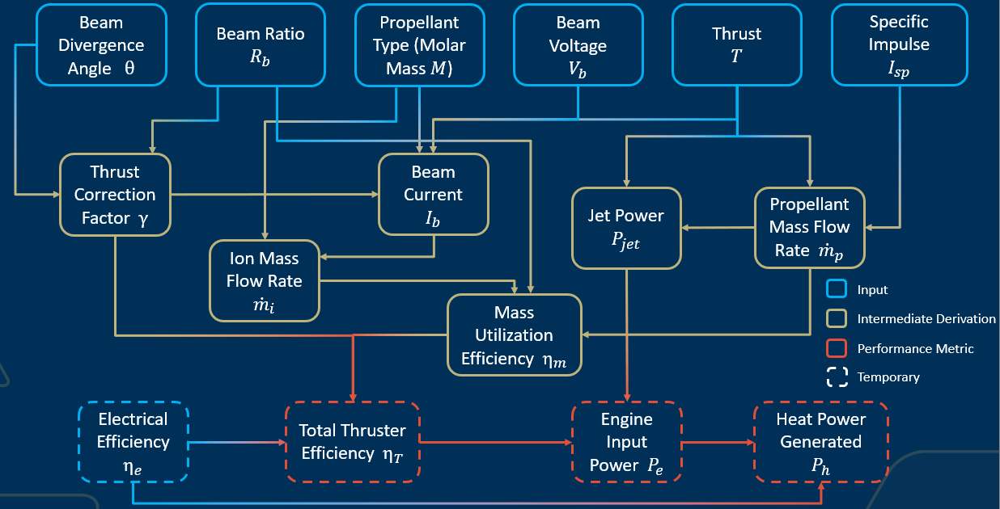
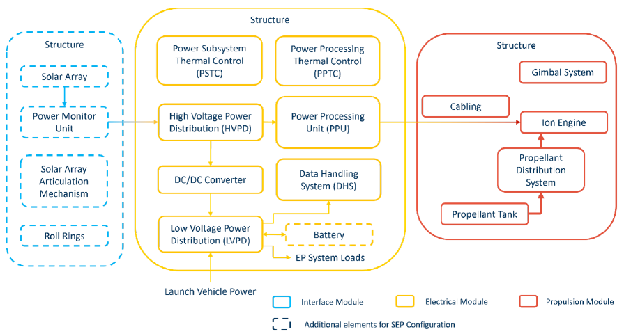
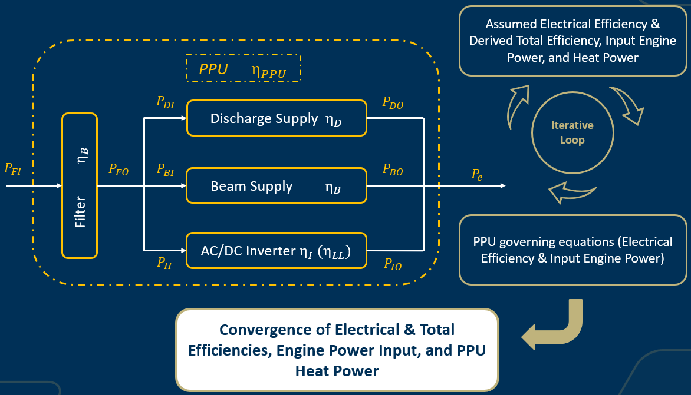

Ion Engine model 
================

Physics-based formulation of Ion Engine working principles to assess performance. The key figures 
of merits include thrust, specific impulse, power consumption, and system mass, where the latter
requires a detailed sub systems decomposition rather than simplified specific mass coefficients.
Ultimately, this tool will be used to perform trade studies and optimization analysis among other 
Propulsion Systems alternatives for Lunar and Martian endeavors, where missions impose higher power supply
requirements.

Disclaimer: Cf code for equations

# Physics-based modeling approach for performance assessment

The performance assessment is performed by implemeting the equations governing the ion engine principles. 
The model aims to derive the performance metrics of interest based on the physics of the ion engine, which
includes capturing the non ideality of the system by taking into account ion beam properties, correction factors, 
and efficiencies.

This formulation allows to link the following inputs and ouputs from Table 1.

Table 1: Ion Engine Performance Model Inputs and Outputs

To fully derive the engine performance, the electrical efficiency has to be assumed. This limitation will be 
overcome by relying on the subsystems decomposition of the propulsion module, especially the Power Processing 
Unit (PPU), that actually governs the power input and therefore the electrical efficiency of the engine.

# Subsystems decomposition for mass assessment

This part aims to give a comprehensive subsystems decomposition of the ion engine. As is, it is based on a specific choice 
of components and is therefore representative of one particular configuration. It be updated to represent any ion
engine given one's specific constraints or engineering reality.
The Ion Propulsion System is therefore decomposed into 3 submodules:

• The Propulsion Module: it is comprised of the engine itself, the gimbal system, the propellant tank, the associated
distribution system, the cabling carrying power, and the overall support structure.

• The Electrical Power System: it is responsible for processing the power coming from the power source, either
solar or nuclear, and is comprised of Power Processing Unit(s) (PPUs), high and low voltage power distribution
systems, converter, Data Handling System (DHS), thermal control systems, the overall support structure, and the
battery system when the solar power source configuration is adopted.

• The Power Interface Module: only applies when the solar power source configuration is envisioned. It considers
the solar array and the systems associated with it such as the Power Monitor Unit (PMU), the articulation
mechanism, roll rings, and the overall support structure.

Table 1 gives a visual representation of this decomposition

Figure 1: Propulsion System Decomposition

The mass of the ddifferent elements of each module is derived as a function of design characteristics or engine performance.
(cf code for equations)

# Closing the Loop

The PPU is responsible for processing the power coming from the power source and distributing it to the electrical subsystems. It 
is comprised of 6 sub components shown Fig. 2: the input filter, the beam and discharge supplies, the DC/AC inverter, low level power 
supplies and command, control, and telemetry circuits.

Figure 2: Power Processing Unit (PPU) simplified schematic

Since the scaling equations are mostly linear, it is assumed they are still valid for ion engines requiring higher
input power. An efficiency is associated with each of the sub components to derive their respective output power.
An iterative loop is then implemented to make the electrical efficiency guessed from the performance model, 𝜂e, 
match the PPU efficiency, 𝜂PPU, and derive the actual total input engine power 𝑃e.

